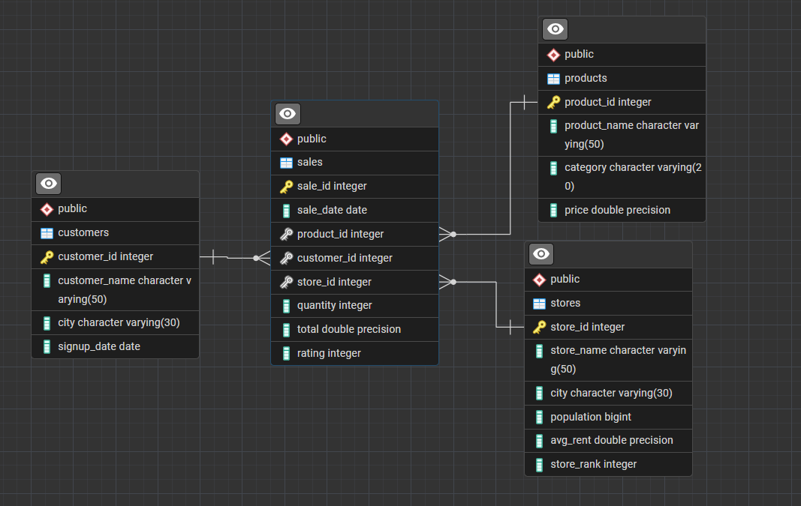

# ☕ Starbucks Sales & Expansion Strategy Analysis (SQL Project)

## 📌 Project Summary
This project analyzes Starbucks store performance, product sales, customer behavior, and market expansion potential using SQL.

The objective is to simulate a real-world business scenario where Starbucks wants to:
* Measure revenue performance
* Identify top-performing products
* Analyze customer distribution
* Compare revenue against rent costs
* Estimate city-level coffee market potential (based on a 25% assumption of coffee drinkers per city)
* Identify the best cities for expansion

All analysis is performed using advanced SQL queries in PostgreSQL.

---

## 🗂 Database Schema
The project uses a relational database with 4 tables:

### 1️⃣ stores
* Store details
* City population
* Average rent
* Store performance ranking

### 2️⃣ customers
* Customer information
* City
* Signup date

### 3️⃣ products
* Product catalog
* Category (Coffee, Tea, Pastry, Merchandise)
* Price

### 4️⃣ sales
* Transaction-level data
* Product, customer & store references (Foreign Keys)
* Quantity sold
* Total revenue
* Customer rating

---

## 🌐 Entity Relationship Diagram (ERD)

---

## 📂 Sample Data
This project includes **synthetic datasets** (AI‑generated for demonstration purposes).  
They do not represent real Starbucks data.  

Datasets are included in this repository and can be accessed directly here:
- [stores.csv](stores.csv)
- [products.csv](products.csv)
- [customers.csv](customers.csv)
- [sales.csv](sales.csv)

---
## 📊 Key Business Questions Solved

### 🔹 Revenue Analysis
* Total revenue in 4th Quarter of 2023
* Store-level revenue comparison
* Month-over-month sales growth
* Peak revenue month

### 🔹 Product Performance
* Units sold per product
* Top 3 best-selling products per city
* Revenue contribution by category

### 🔹 Customer Insights
* Unique customers per city
* Average revenue per customer by city

### 🔹 Store & City Efficiency
* Highest & lowest revenue-generating stores
* Revenue per capita by city
* Sales vs rent comparison
* Sales-to-rent efficiency ratio

### 🔹 Market Expansion Strategy
Built two expansion models:

**1️⃣ Simple Ranking Model**
* High sales
* High estimated coffee consumers (25% assumption from Q1)
* Low rent cost

**2️⃣ Weighted Expansion Score Model**
| Metric                     | Weight |
| -------------------------- | ------ |
| Total Sales                | 40%    |
| Customer Base              | 25%    |
| Estimated Coffee Consumers | 20%    |
| Rent (Inverted)            | 15%    |

The final output ranks cities by expansion potential.

---

## 🌟 Project Highlights
Here are three queries that best showcase advanced SQL and business insight:

1. **Q4 – Monthly Sales Growth**  
   Uses `LAG()` window function to calculate month-over-month growth rates, showing trends in revenue performance.

2. **Q7 – Top 3 Selling Products per City**  
   Combines aggregation with `DENSE_RANK()` to identify the top products in each city, simulating localized product strategy.

3. **Q14 – Market Expansion Potential**  
   Builds both a simple ranking and a weighted scoring system (with normalization) to evaluate expansion opportunities across cities.

---

## 📈 Key Insights
- **Revenue Trends (Q4 & Q5)**: Seasonal peaks highlight opportunities for targeted promotions.  
- **Product Strategy (Q6 & Q7)**: Coffee dominates, but city-level differences suggest localized product focus.  
- **Customer Distribution (Q9 & Q10)**: Smaller cities often show higher average sales per customer, indicating stronger loyalty.  
- **Operational Efficiency (Q11 & Q12)**: Some high-revenue stores are offset by high rent, while smaller stores outperform on efficiency.  
- **Expansion Potential (Q14)**: Weighted scoring reveals that expansion isn’t just about sales volume—cities with large coffee consumer bases and manageable rent costs often rank higher than expected.

---

## 🧠 SQL Skills Demonstrated
* Complex `JOIN` operations
* CTEs (`WITH` clauses)
* Window Functions:
  * `LAG()` (MoM Growth)
  * `DENSE_RANK()`
  * `MAX() OVER()`
* Date extraction (`EXTRACT()`)
* Aggregations (`SUM`, `COUNT`, `AVG`)
* Data normalization
* Business metric modeling
* Multi-factor scoring system

---

## 📈 Business Impact
This project demonstrates how SQL can be used to:
* Drive expansion decisions
* Evaluate operational efficiency
* Identify high-performing products
* Measure customer engagement
* Support data-driven retail strategy

---

## 🛠 Tech Stack
* PostgreSQL
* SQL
* Relational Database Design

---

## 🚀 Possible Enhancements
* Profit margin calculation
* Customer segmentation (new vs repeat buyers)
* Time-series forecasting
* Dashboard integration (Power BI / Tableau)
* Cohort analysis
* Store-level profitability analysis

---

## 📂 Getting Started
1. Install PostgreSQL.  
2. Run the schema creation script to set up tables.  
3. Import data in this order:
   * stores
   * products
   * customers
   * sales  
4. Execute analytical queries (Q1–Q14) to generate insights.

---

## 👨‍💻 Author
**Harold Alcabasa**  
SQL Data Analytics Portfolio Project (2026)  
[GitHub](https://github.com/alcabasaharold) | [LinkedIn](https://www.linkedin.com/in/harold-alcabasa-16b095227/)

